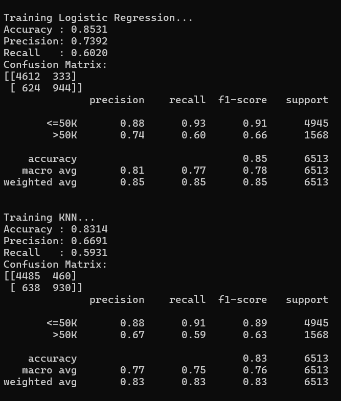
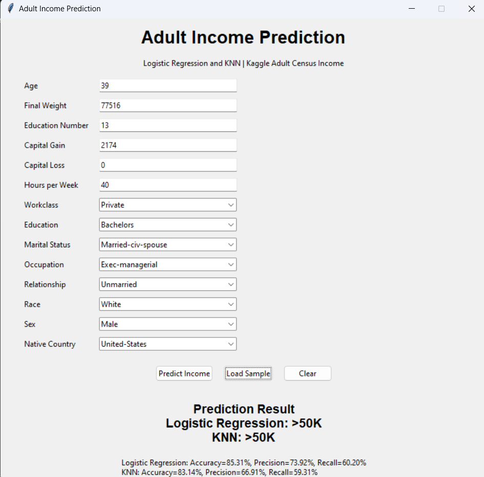

# Adult Income Prediction using Logistic Regression and KNN

## 1. Assigned Topic
**Adult Income Prediction using Logistic Regression and KNN**

## 2. Kaggle Dataset
**Adult Census Income**  
Kaggle: https://www.kaggle.com/datasets/uciml/adult-census-income

The dataset predicts whether a person's annual income is greater than $50K using census and employment attributes.

## 3. Models Used
- Logistic Regression
- K-Nearest Neighbors (KNN)

## 4. Data Preparation
1. Load the Kaggle CSV.
2. Clean column names and whitespace.
3. Convert `?` values to missing values.
4. Convert numeric columns to numeric type.
5. Handle missing numerical values using median imputation.
6. Handle missing categorical values using most-frequent imputation.
7. Encode categorical variables using One-Hot Encoding.
8. Scale numerical features using StandardScaler.
9. Split the data into 80% training and 20% testing data using stratification.

## 5. Evaluation
The training program reports:
- Accuracy
- Precision
- Recall
- Confusion Matrix
- Classification Report

The actual scores are generated from the Kaggle dataset when `train_model.py` is run.

## 6. Project Structure

```text
adult_income_prediction/
│
├── data/
│   └── adult.csv
│
├── models/
│   └── income_models.joblib
│
├── screenshots/
│   ├── model_output.png
│   └── gui_prediction.png
│
├── train_model.py
├── gui.py
├── requirements.txt
├── README.md
└── .gitignore
```

## 7. How to Run

### Install packages

```bash
pip install -r requirements.txt
```

### Add the Kaggle dataset

Download the **Adult Census Income** dataset from Kaggle and place the CSV file here:

```text
data/adult.csv
```

### Train the models

```bash
python train_model.py
```

This creates:

```text
models/income_models.joblib
```

### Start the GUI

```bash
python gui.py
```

Click **Load Sample**, then click **Predict Income**. The GUI displays the predictions from both Logistic Regression and KNN.

## 8. Sample GUI Input

- Age: 39
- Workclass: Private
- Education: Bachelors
- Education Number: 13
- Marital Status: Married-civ-spouse
- Occupation: Exec-managerial
- Relationship: Husband
- Race: White
- Sex: Male
- Capital Gain: 2174
- Capital Loss: 0
- Hours per Week: 40
- Native Country: United-States

The prediction shown in the screenshot should be the actual output produced by the trained models. Do not manually invent an accuracy or prediction result.

## Output Screenshots

### 1. Model Evaluation Output

The following screenshot shows the performance of Logistic Regression and KNN, including accuracy, precision, recall, and confusion matrix.



### 2. Tkinter GUI Prediction

The following screenshot shows the Tkinter GUI with sample input and income prediction results.



## 9. GitHub Submission

Create a **public** GitHub repository, upload the project files, and submit the repository URL.

Before submission, verify:
- The repository is public.
- `README.md` is visible.
- The Kaggle dataset link opens.
- `train_model.py` runs successfully.
- `models/income_models.joblib` is included.
- `gui.py` starts successfully.
- Screenshots are included.
- The GUI prediction is generated by the saved model.

## 10. Student Details

**Name:** Sravani Pendyala  
**Topic:** Adult Income Prediction using Logistic Regression and KNN
